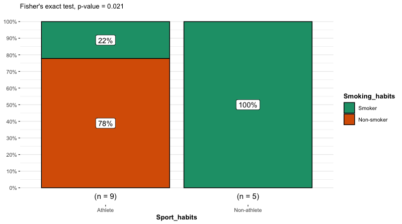

# Fisher's exact test

The Fisher's exact test is used to determine if two categorical variables are independent.
Typically, this test is used as an alternative to the chi-square test of independence when the sample size is small (n < 10).
The Fisher's exact test can only be used in a 2 x 2 contingency table.
If multiple categories are being evaluated, pairwise comparisons between the categories must be made.

The ***null hypothesis*** for the Fisher's exact this that the variables are independent.

The ***alternative hypothesis*** for the Fisher's exact test is that the variables are NOT independent.

## Values needed to conduct a Fisher's exact test

To conduct a Fisher's exact test, you will need arrange your count data in a 2 x 2 matrix/contingency table where the cells in the matrix contain the count data for a specific category.

|            | Group A | Group B |
| ---------- | ------- | ------- |
| Catagory 1 | 8       | 5       |
| Catagory 2 | 3       | 9       |

## Values returned from a Fisher's exact test

- degrees of freedom: (sample size - 1) the number of values that have the freedom to vary in the dataset.
- P-value: indicates if the variables have a statistically significant association.
  - P-value < 0.05 indicates the variables have a statistically significant association and are NOT independent (Reject the null hypothesis).
  - P-value > 0.05 indicates that you cannot conclude that the variables are associated/independent (Fail to reject the null hypothesis).

## Visualizing the results

Just because you ran the analysis in JMP does not mean you have to use JMP to visualize your results. As long as you have a statistically significant result you can generate the plots however you would like (e.g., Excel, Google Sheets, R, Python).
All you need to do is add an annotation to the figure that the P-value was < 0.05.
A good way to visualize the results of a Fisher's exact test would be to a paired or grouped bar chart.
These types of bar charts can clearly display the variation in counts vary between the relevant categories of interest.

