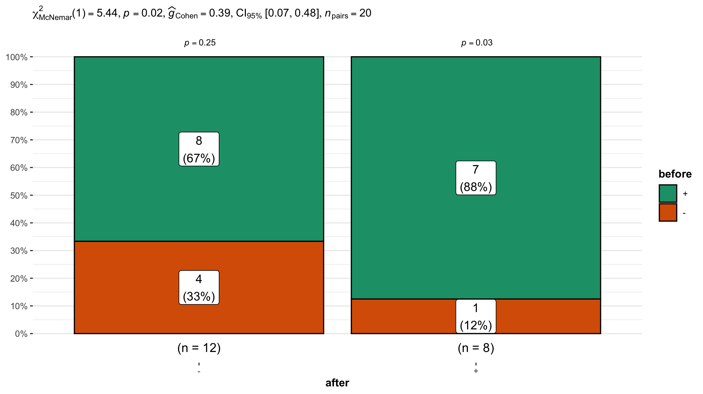

# McNemar test

The McNemar test is a nonparametric test for paired [nominal data](../pages/catvsnumdata.md).
What this basically means is that you are finding a change in proportion between paired data.
The McNemar test can also be considered the nonparametric equivalent to the paired T-test.

The ***null hypothesis*** of a McNemar test is that the proportion between the two groups are the same.

The ***alternative hypothesis*** of a McNemar test is that the proportion between two groups are different.

An example of when to use the McNemar test is presented below:

Say you wanted to determine if a particular drug helps reduce the amount of joint pain experienced by an arthritic individual.
You record if your group is experiencing pain before and after administering the drug.

You can then create a contingency table with your observations and perform a McNemar test.

|                  | Pain (after) | No pain (after) |
| ---------------- | ------------ | ---------------- |
| Pain (before)    | 30           | 45               |
| No pain (before) | 50           | 67               |

There are 3 assumptions for the McNemar Test:
- There must be one nominal variable with with two categories (yes/no, heads/tails, pass/fail)
- The two groups in your dependent variable must be mutually exclusive; participants cannot appear in more than 1 groups
- The sample must be random

If your data does meet these criteria you may want to consider using a [chi-square](../pages/chisquare.md)

## Visualizing the results

Just because you ran the analysis in JMP does not mean you have to use JMP to visualize your results. As long as you have a statistically significant result you can generate the plots however you would like (e.g., Excel, Google Sheets, R, Python).
All you need to do is add an annotation to the figure that the P-value was < 0.05.
A good way to visualize the results of a chi-square test would be to a paired or grouped bar chart.
These types of bar charts can clearly display the variation in counts vary between the relevant categories of interest.

