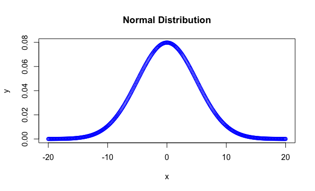

# What is a normal distribution?

***TL;DR - When visualized, a normal distribution is a bell curve. Points around the mean occur at a higher frequency than points further from the mean.***

The normal distribution, also known as a Gaussian distribution is a probability distribution that is symmetric about the mean.
Symmetric distributions are where a dividing line can produce two mirror images.
In this case, the dividing line also happens to occur at the mean.

***Something to keep in mind is that all normal distributions are symmetric but not all symmetric distributions are normal distributions.***

In practice, this means that the data points that lie closer to the mean occur more frequently than the data points in the periphery (see the figure above).
Conveniently in nature, many naturally occurring phenomena tend to follow a normal distribution.

# Standard deviations and normal distributions

Another thing to keep in mind is how standard deviation are used in normal distributions.
Standard deviation is a measure of how dispersed the data points are relative to the mean.
A low standard deviation indicates clustered data while a high standard deviation indicates a spread data.

In a normal distribution, 68% of values around found within +/- 1 standard deviation away from the mean.
In a normal distribution, 95% of values around found within +/- 2 standard deviation away from the mean.
In a normal distribution, 99.7% of values around found within +/- 3 standard deviation away from the mean.

Typically, in statistics we use critical value that returns a 95% confidence interval meaning that +/- 2 standard deviations will account for 95% of naturally occurring variation within a normally distributed dataset.
