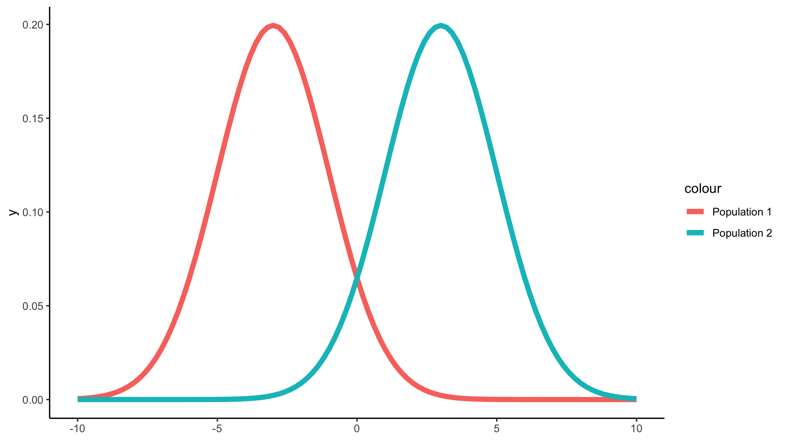

# What are statistical hypotheses?

If you have had any interactions with statistics or statistical tests something you have probably come across are the terms ***"null hypothesis (H0)"*** and ***"alternative hypothesis (H1)"***.
The idea of hypothesis testing lies at the core of the scientific method and is a useful tool to help you determine if patterns you observe in your data a "significant". This "significant" difference can either support (or not support) the difference that you expect to see between two (or more) sample sets.

Classically, the null and alternative hypotheses are two mutually exclusive statements about a population.
Simply put: a null hypothesis can state that two populations are the same while the alternative hypothesis is that two populations are NOT the same.
All statistical tests are doing is allowing you to describe if the difference is large enough to claim the populations in question are NOT the same.

A large misconception here is that by rejecting the null hypothesis, you are accepting your alternative hypothesis.
This is not the case.
Another misconception is when you cannot reject the null hypotheses you are accepting your null hypotheses.
This is also not the case.

At the end of the day you are either going to say ***"I fail to reject the null hypothesis"*** or ***"I reject the null hypothesis".***
There should be no mention of accepting any hypotheses at all.

This may seem like a trivial difference in wording but it is extremely important.

When you have a p-value < 0.05 and you reject your null hypotheses you are merely stating that you have enough evidence to say that the assumption that the two populations are indistinguishable is not the case.
When you have a p-value > 0.05 and you fail to reject your null hypothesis you are merely stating that you DO NOT have enough evidence to say that the two populations are distinguishable.

During your project you are trying your darndest to gain enough evidence to statistically claim that two (or more) populations are different and that the treatment you have isolated MAY have contributed to the difference you observe.
