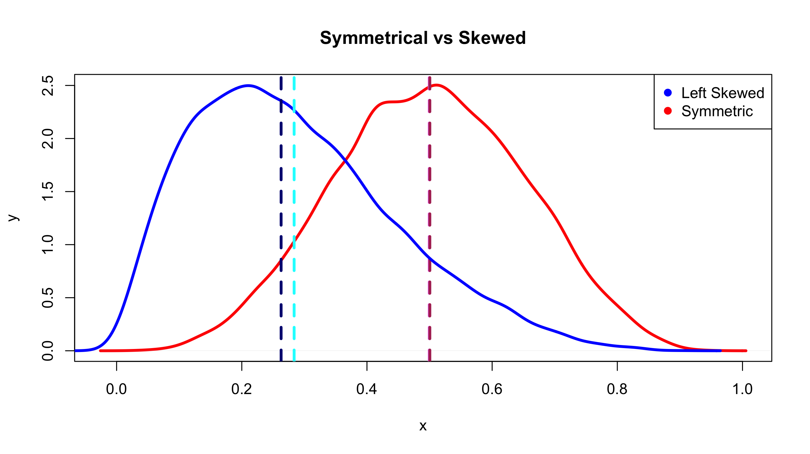

# Parametric vs Non Parametric

***TL;DR - parametric statistics are are based on the assumption that the population(s) in question follows a normal distribution.
Nonparametric statistics are NOT based on the assumption that the population(s) in question falls under a normal distribution.
For each parametric statistical test, there is usually a nonparametric alternative: chi-square test of independence (parametric) vs Fisher's exact test (nonparametric).***

Parametric and nonparametric statistics are mirror images of each other in a sense.
In order to understand what this means we have to look at the assumptions that are made when using a particular statistical test.

# Parametric statistics
The world of parametric statistics makes the HUGE assumption that the populations being sampled are [normally distributed](../pages/normal_dist.md).
However, we know just from existing in this world that this is not always the case.
Maybe the sample size is small and we don't truly know of it is representative of the larger population.
Or maybe we have prior knowledge that the population we intend to sample is skewed in a particular direction or is potentially bimodal.

Based on our assumption that populations tend to follow a normal distribution, when we apply a parametric test, we are basically creating an "imaginary", normally distributed, population where both of our real sample sets exist.
This "imaginary" population contains its own mean, standard deviation, and variance based the combination of both real sample sets.
We then find the odds of randomly drawing our sample sets from this imaginary population.
If the odds are good, we can conclude there is no significant difference between the real sample sets.
If the odds are bad, we can conclude there is a significant difference between the real sample sets.

So, what do we do when our intended population is not normally distributed?
Well, we use statistics that are not parametric, aka nonparametric statistics.

# Nonparametric statistics
Nonparametric statistics do NOT assume anything about the distribution of the population being sampled.
This means nonparametric statistics can be used if either if you population is normally distributed AND if your population is NOT normally distributed.

These sorts of statistical tests pit the populations directly against each other purely based on the data that is given.

So, why in the world would be every even consider using a parametric test if nonparametric tests are basically a catch-all and only use the data that is given?

That's where your judgement has to enter the picture.
Although nonparametric statistics can be used in all situations, they generally have less statistical power than parametric statistics.
As a result, nonparametric tests tend to have higher rates of ***type II error*** (failing to reject the null hypothesis when it is false; ***a false negative***).
Parametric statistics, on the other hand, are more forgiving when the variance/spread of the groups being compared is different leading to a lower rate of type II error but if your populations do NOT follow a normal distribution you run the risk of a ***type I error*** (rejecting the null hypothesis when it is false; ***a false positive***)

For the reasons listed above, is is extremely important for you to think about your sampling method(s) and the population you intend to sample.
When you understand what to expect from your populations in question and how you intend to sample these populations, you will have a much easier time deciding on what test to use when.  

# Some examples pf parametric test and their nonparametric counterparts:

| Parametric      | Nonparametric             |
| --------------- | ------------------------- |
| 2-sample T-test | Wilcoxon rank-sum test    |
| Paired T-test   | Wilcoxon signed-rank test |
| ANOVA           | Kruskal Wallis test       |
| Chi-square test | Fisher's Exact test       |
