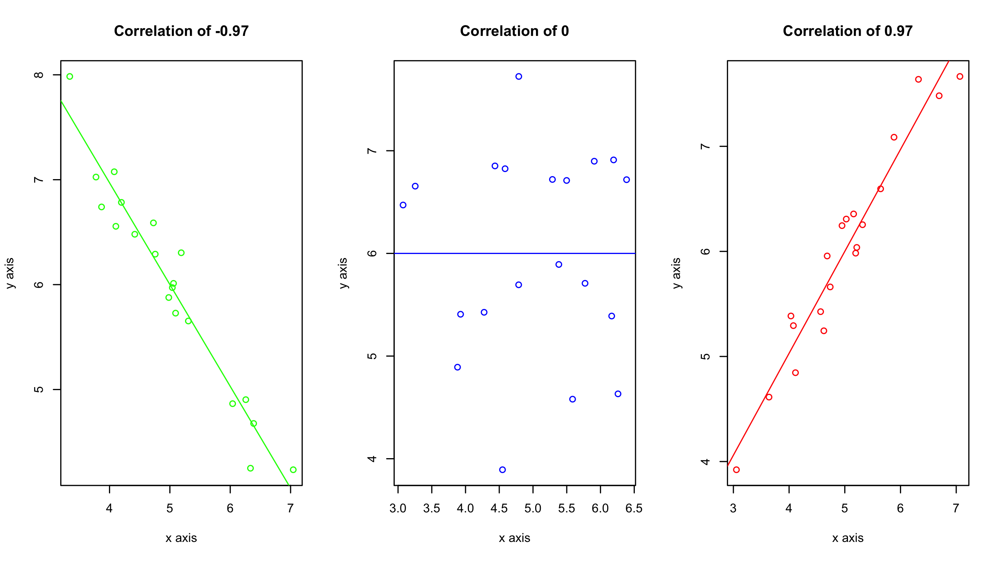
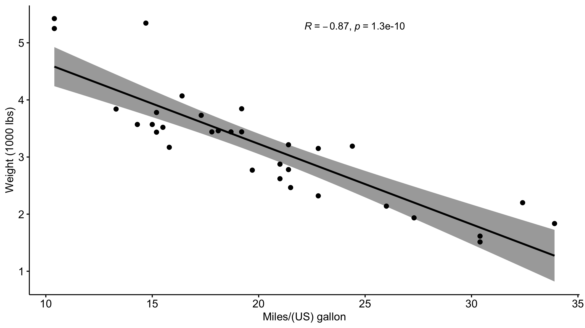

# Spearman's rank correlation

Spearman's rank correlation is a statistical measure used to assess the strength and direction of the relationship between two variables.
Unlike Pearson's correlation, which assumes a linear relationship between the two variables, Spearman's correlation does not assume a specific form of the relationship and is based on the ranks of the observations rather than their actual values.
Specifically, the Spearman's rank correlation assess if a monotonic function can be used to describe the data.

***Monotonic function:*** a function between ordered sets of data that either preserves or reverses the order.

Is a monotonic function:
- Linear
- Exponential
- Logarithmic

Is NOT a monotonic function:
- Quadratic
- Sinusoidal

This also means that the relationship between variables can be non linear.
This will be extremely important when interpreting the Spearman's rank correlation coefficient (rho).

***The Spearman's rank correlation coefficient (rho) can range from -1 to +1.***
A value of -1 indicates a perfect negative correlation, while a value of +1 indicates a perfect positive correlation.
A value of 0 indicates no correlation between the variables.
As a general rule of thumb use the following cut offs to determine the strength of the observed relationships:
- ***Perfect:*** If the value is near ± 1, then it said to be a perfect correlation: as one variable increases, the other variable tends to also increase (if positive) or decrease (if negative).
- ***High degree:*** If the coefficient value lies between ± 0.50 and ± 1, then it is said to be a strong correlation.
- ***Moderate degree:*** If the value lies between ± 0.30 and ± 0.49, then it is said to be a medium correlation.
- ***Low degree:*** When the value lies below + .29, then it is said to be a small correlation.
- ***No correlation:*** When the value is zero.

# Example of when and how to use a Spearman's rank correlation

Let's say you are conducting a study on the correlation between people's love for pizza and their willingness to watch cheesy romantic comedies.
You survey a group of 20 participants and ask them to rate their love for pizza on a scale of 1 to 10, and their willingness to watch cheesy romantic comedies on a scale of 1 to 5.

You end up with data that looks like the following:

| Pizza love   | Cheesy Romcom Willingness |
| ------------ | ------------------------- |
| 5            | 3                         |
| 6            | 3                         |
| 7            | 4                         |
| 6            | 3                         |
| 8            | 4                         |
| 2            | 1                         |
| 3            | 2                         |
| 8            | 4                         |
| 9            | 5                         |
| 10           | 5                         |

The Spearman's correlation coefficient (rho) comes out to be rho = 1.0, which is a perfect positive correlation.
Something to understand here is that rho does not mean a strong linear relationship.
***A high rho just indicates that there is a positive correlation; nothing about the nature of that positive correlation.***
This positive correlation could be logarithmic, exponential, or linear.
You won't know which one it is unless you plot it.

# Visualizing the results

Just because you ran the analysis in JMP does not mean you have to use JMP to visualize your results.
As long as you have a statistically significant result you can generate the plots however you would like (e.g., Excel, Google Sheets, R, Python).
All you need to do is add an annotation to the figure that has the rho value displayed.
A scatter plot would be a good way of visualizing the results of a Spearman's correlation test.
The scatter plot would present both the spread of the data while also visualizing the trend between the variables.

