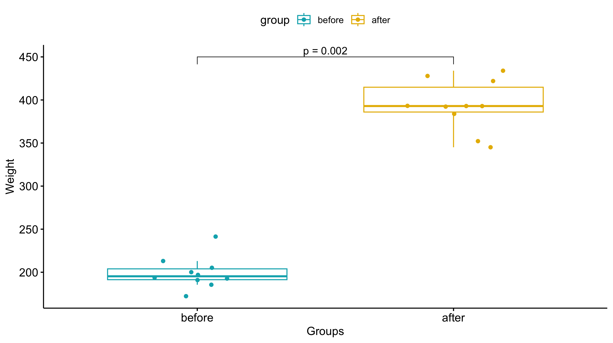

# Wilcoxon Tests

Wilcoxon tests are non-parametric statistical tests that are used to compare two groups when you have reason to believe your sample is NOT normally distributed OR your sample size is small.
If you do not recognize the terms parametric or non-parametric please follow [this link](../pages/parametric.md).

Much like a T-test, Wilcoxon tests are used to calculated the difference between sets of pairs and allows to test for a statistically significance difference but there are no underlying assumptions about the distribution of the population.

For example, if you have data from an experiment when you score the before and after condition of a particular treatment but your sample size is extremely small you would used a Wilcoxon test instead of a paired T-test.

Wilcoxon tests come in two flavors:
- Wilcoxon rank sum: do two ***unpaired*** populations have the same mean?
  - ***Null hypothesis:*** there is no significant difference between two groups
  - ***Alternative hypothesis:*** there is significant difference between the two groups
- Wilcoxon signed rank: do two ***paired*** populations have the same mean?
  - This is the non-parametric equivalent to the T-test
  - ***Null hypothesis:*** the means between the two groups are the same.
  - ***Alternative hypothesis:*** the means between two groups are different.

To conduct a Wilcoxon test using JMP, Excel, or R, you will need your data points recorded in two columns; one column for each treatment.
The data for this analysis should be numeric.
Then conduct the analysis by specifying which column corresponds to which group.

## Values needed to conduct a Wilcoxon test

### Here is an example of how your data should be formatted for a Wilcoxon rank sum test:

| Height Group 1 (inches) | Height Group 2 (inches)  |
| ----------------------- | ------------------------ |
| 68                      | 48                       |
| 70                      | 50                       |
| 75                      | 60                       |
| 70                      | 52                       |
| 72                      | 55                       |
| 73                      | 58                       |
| 77                      | 56                       |
| 78                      | 59                       |
| 71                      | 51                       |

### Here is an example of how your data should be formatted for a Wilcoxon signed rank test:

| Subject No. | Reaction Time pre (ms) | Reaction Time post (ms)  |
| ----------- | ---------------------- | ------------------------ |
| Subject 1   | 168                    | 148                      |
| Subject 2   | 170                    | 150                      |
| Subject 3   | 175                    | 160                      |
| Subject 4   | 170                    | 152                      |
| Subject 5   | 172                    | 155                      |
| Subject 6   | 173                    | 158                      |
| Subject 7   | 177                    | 156                      |
| Subject 8   | 178                    | 159                      |
| Subject 9   | 171                    | 151                      |

## Values returned from a Wilcoxon test

The Wilcoxon test will produce the following values. I have provided a brief description of how to interpret them.
- Z-score: the number of standard deviations away from the mean out value of interest is.
- P-value: the probability that the results from your sample occurred by random chance. Important note: the p-value does not indicate that the treatment is the CAUSE. All that it states is that the two means are significantly different from each other.
  - P-value < 0.05 indicates the means of each group are different from each other (Reject the null hypothesis)
  - P-value > 0.05 indicates that you cannot conclude that means of each group are different from each other (Fail to reject the null hypothesis)

## Visualizing the results
Just because you ran the analysis in JMP does not mean you have to use JMP to visualize your results. As long as you have a statistically significant result you can generate the plots however you would like (e.g., Excel, Google Sheets, R, Python).
All you need to do is add an annotation to the figure that the P-value was < 0.05.A box-and-whisker plot would be a good way of visualizing the results of a Wilcoxon test.
The box-and-whisker plot would present both the spread of the data while also incorporating error bars associated with the mean calculation.

