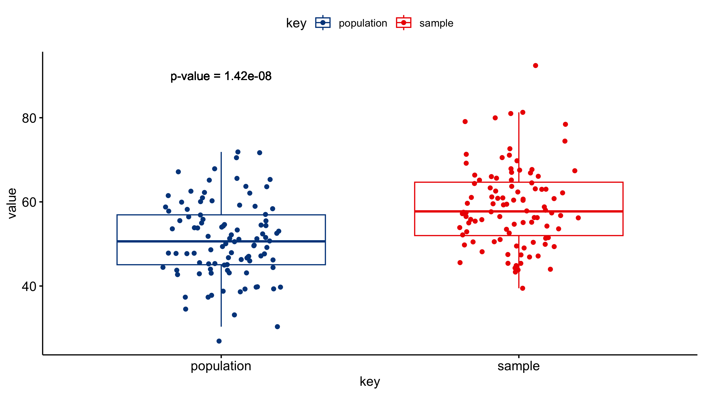

# Z-test

The best way to begin thinking about the Z-test is that it's extremely similar to a T-test.
Both of these tests look for a significant difference between the means of two populations.
However, while the T-test is great for populations ≤ 30 where the variance is unknown, the Z-test is more suited for larger populations ≥ 30 where the variance is known.
This specification is necessary because when you are using the Z-test you are comparing your sample to a known population; the "known" part of this "known population" refers to a well sampled population where the variance, standard deviation is known.

The ***null hypothesis*** of a Z-test is that the means between the two groups are the same.

The ***alternative hypothesis*** of a Z-test is that the means between two groups are different.

# Example of when and how to use a Z-test

Imagine you are the coach of a basketball team and you want to know if your team's average number of rebounds per game has significantly increased since you started having them wear lucky socks during games.
You have data on the number of rebounds per game for the past month.

Your null hypothesis would be that there is no significant difference in the average number of rebounds per game between the period before and after the introduction of the lucky socks.
The alternative hypothesis is that there is a difference.

When collecting you data you can record it like a [T-test](../pages/ttest.md) but you must make sure the number of observations you have is ≥ 30 for each population.

If the z-test shows a significant difference, you can continue to have your team wear the lucky socks and celebrate their newfound success on the court. However, if the test shows no significant difference, you may want to reconsider the role of the lucky socks and come up with a new strategy for motivating your team.

# Visualizing the results
Just because you ran the analysis in JMP does not mean you have to use JMP to visualize your results.
As long as you have a statistically significant result you can generate the plots however you would like (e.g., Excel, Google Sheets, R, Python).
All you need to do is add an annotation to the figure that the P-value was < 0.05.
A box-and-whisker plot would be a good way of visualizing the results of a Z-test.
The box-and-whisker plot would present both the spread of the data while also incorporating error bars associated with the mean calculation.

